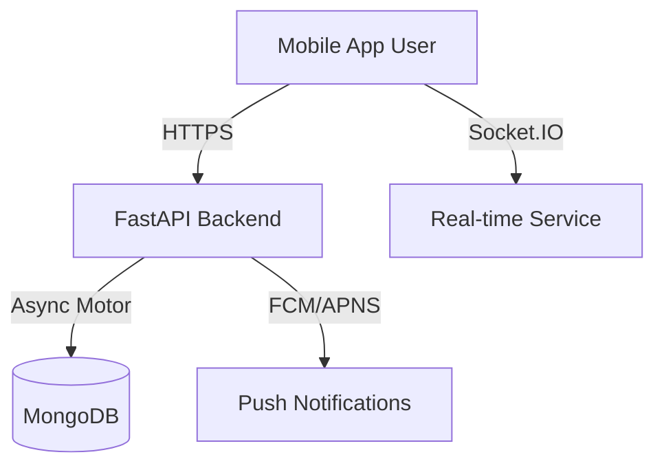

# System Architecture 🏗️

This document provides a high-level overview of the AISJ Connect architecture.

## High-Level Overview

## Backend Architecture (Python FastAPI)

We follow a **Clean Architecture** pattern with 3 distinct layers to enforce separation of concerns:

### 1. Presentation Layer (Routes)
*   **Location**: `backend/routes/`
*   **Responsibility**: Handle incoming HTTP requests, validate input (Pydantic), and return responses.
*   **Rule**: NO business logic here. Just routing and delegation.

### 2. Service Layer (Business Logic)
*   **Location**: `backend/app/services/`
*   **Responsibility**: Core business rules, verification, specific algorithms, and orchestration.
*   **Rule**: Interfaces with Repositories. Does not know about HTTP.

### 3. Data Access Layer (Repositories)
*   **Location**: `backend/app/repositories/`
*   **Responsibility**: Direct database interactions (CRUD).
*   **Rule**: The only layer that speaks to MongoDB.

## Frontend Architecture (React Native)

### Navigation
We use **Expo Router** (file-based routing):
*   `app/index.tsx`: Entry point.
*   `app/(tabs)/`: Main app screens (Dashboard, Pass, ID, etc).

### State Management
*   **Context API**: Used for global state like Authentication (`AuthContext`).
*   **Local State**: `useState` / `useReducer` for component-specific logic.

### API Layer
*   **Centralized Client**: `frontend/api/client.ts` handles Axios instances and Interceptors (token injection).
*   **Modules**: Each feature has a dedicated API file (e.g., `api/passes.ts`) to keep components clean.

## Data Flow Example: Creating a Smart Pass

1.  **UI**: User taps "Request Pass" in `frontend/app/(tabs)/smart-pass.tsx`.
2.  **API**: Frontend calls `passes.createPass()`.
3.  **Route**: `backend/routes/passes.py` receives request & validates token.
4.  **Service**: `PassService` checks active pass limits and business rules.
5.  **Repository**: `PassRepository` inserts document into MongoDB `passes` collection.
6.  **Response**: Success message returned to UI.
